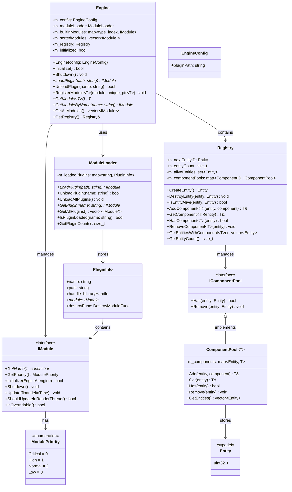
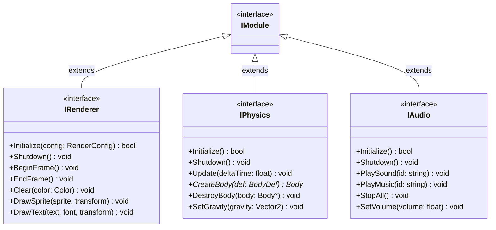

# R-Type Engine - Developer Documentation

## Table of Contents

1. [Overview](#overview)
2. [Architecture](#architecture)
3. [Core Components](#core-components)
   - [Engine](#engine)
   - [Module System](#module-system)
   - [ECS (Entity Component System)](#ecs-entity-component-system)
4. [Class Diagrams](#class-diagrams)
5. [Creating a Module](#creating-a-module)
6. [Using the ECS](#using-the-ecs)
7. [Build System](#build-system)
8. [API Reference](#api-reference)

---

## Overview

The R-Type Engine is a modular game engine built with C++17. It features:

- **Plugin-based architecture**: Load modules dynamically at runtime
- **Entity Component System (ECS)**: Data-oriented design for game objects
- **Cross-platform**: Works on Linux, macOS, and Windows

### Project Structure

```
engine/
├── include/
│   ├── Core/
│   │   ├── Engine.hpp        # Main engine class
│   │   ├── Module.hpp        # IModule interface
│   │   ├── ModuleLoader.hpp  # Dynamic plugin loader
│   │   └── Logger.hpp        # Logging utility
│   └── ECS/
│       ├── Entity.hpp        # Entity type definition
│       ├── Component.hpp     # Component definitions
│       └── Registry.hpp      # ECS registry
└── src/
    ├── Core/
    │   ├── Engine.cpp
    │   └── ModuleLoader.cpp
    └── ECS/
        └── Registry.cpp
```

---

## Architecture

The engine follows a layered architecture:

```
┌─────────────────────────────────────────┐
│            GAME / APPLICATION           │
│         (Uses engine as library)        │
└─────────────────────────────────────────┘
                    │
                    ▼
┌─────────────────────────────────────────┐
│              ENGINE CORE                │
│   ┌─────────┐  ┌─────────┐  ┌───────┐  │
│   │ Engine  │  │ Module  │  │  ECS  │  │
│   │         │  │ Loader  │  │       │  │
│   └─────────┘  └─────────┘  └───────┘  │
└─────────────────────────────────────────┘
                    │
                    ▼
┌─────────────────────────────────────────┐
│              MODULES/PLUGINS            │
│  ┌──────────┐ ┌─────────┐ ┌─────────┐  │
│  │ Renderer │ │ Physics │ │  Audio  │  │
│  └──────────┘ └─────────┘ └─────────┘  │
└─────────────────────────────────────────┘
```

---

## Core Components

### Engine

The `Engine` class is the central coordinator that manages:
- Module lifecycle (registration, initialization, shutdown)
- Plugin loading/unloading
- Access to the ECS Registry

#### Basic Usage

```cpp
#include <Core/Engine.hpp>

int main() {
    RType::Core::EngineConfig config;
    config.pluginPath = "./plugins";

    auto engine = std::make_unique<RType::Core::Engine>(config);

    // Load plugins
    engine->LoadPlugin("plugins/libRenderer.so");

    // Initialize all modules
    engine->Initialize();

    // Access the ECS registry
    auto& registry = engine->GetRegistry();

    // Shutdown
    engine->Shutdown();

    return 0;
}
```

#### EngineConfig

| Field | Type | Default | Description |
|-------|------|---------|-------------|
| `pluginPath` | `std::string` | `"./plugins"` | Directory for plugin search |

---

### Module System

Modules are the building blocks of the engine. They can be:
- **Built-in**: Compiled with the engine
- **Plugins**: Loaded dynamically from shared libraries (.so/.dll)

#### IModule Interface

All modules must implement `IModule`:

```cpp
class IModule {
public:
    virtual ~IModule() = default;
    virtual const char* GetName() const = 0;
    virtual ModulePriority GetPriority() const = 0;
    virtual bool Initialize(Engine* engine) = 0;
    virtual void Shutdown() = 0;
    virtual void Update(float deltaTime) = 0;
    virtual bool ShouldUpdateInRenderThread() const { return false; }
    virtual bool IsOverridable() const { return true; }
};
```

#### Module Priority

Modules are initialized in priority order (lowest value first):

| Priority | Value | Use Case |
|----------|-------|----------|
| `Critical` | 0 | Core systems that others depend on |
| `High` | 1 | Rendering, Physics |
| `Normal` | 2 | Audio, Input |
| `Low` | 3 | Non-essential features |

Shutdown occurs in **reverse** priority order.

#### Plugin Export Functions

Plugins must export these C functions:

```cpp
extern "C" {
    RTYPE_MODULE_EXPORT RType::Core::IModule* CreateModule();
    RTYPE_MODULE_EXPORT void DestroyModule(RType::Core::IModule* module);
}
```

The `extern "C"` prevents C++ name mangling, allowing `dlsym()` to find the functions.

#### RTYPE_MODULE_EXPORT Macro

This macro ensures symbols are exported correctly on all platforms:

```cpp
#ifdef _WIN32
#define RTYPE_MODULE_EXPORT __declspec(dllexport)
#else
#define RTYPE_MODULE_EXPORT __attribute__((visibility("default")))
#endif
```

#### Function Pointer Types

The module loader uses these types internally:

```cpp
using CreateModuleFunc = IModule* (*)();
using DestroyModuleFunc = void (*)(IModule*);
```

#### Platform-Specific Plugin Extensions

| Platform | Extension | Load Function |
|----------|-----------|---------------|
| Linux | `.so` | `dlopen()` |
| macOS | `.dylib` or `.so` | `dlopen()` |
| Windows | `.dll` | `LoadLibrary()` |

---

### ECS (Entity Component System)

The ECS provides a data-oriented approach to game object management.

#### Concepts

- **Entity**: A unique identifier (uint32_t)
- **Component**: Plain data struct attached to entities
- **Registry**: Manages entities and their components

#### Entity

```cpp
using Entity = uint32_t;
constexpr Entity NULL_ENTITY = 0;
```

#### Built-in Components

```cpp
struct Position {
    float x = 0.0f;
    float y = 0.0f;
};

struct Velocity {
    float dx = 0.0f;
    float dy = 0.0f;
};
```

#### Registry Methods

| Method | Description |
|--------|-------------|
| `CreateEntity()` | Create a new entity |
| `DestroyEntity(entity)` | Destroy an entity |
| `IsEntityAlive(entity)` | Check if entity exists |
| `AddComponent<T>(entity, component)` | Add component to entity |
| `GetComponent<T>(entity)` | Get component from entity |
| `HasComponent<T>(entity)` | Check if entity has component |
| `RemoveComponent<T>(entity)` | Remove component from entity |
| `GetEntitiesWithComponent<T>()` | Get all entities with component |
| `GetEntityCount()` | Get total entity count |

---

## Class Diagrams

### Complete Architecture



### Example Module Interfaces (To Be Implemented)

These interfaces are **suggestions** for modules to be implemented by your team:



> **Note**: These interfaces are not included in the engine. You need to create these based on your specific requirements and the graphics/audio/physics libraries you choose (SFML, SDL2, Raylib, Box2D, etc.).

---

## Creating a Module

### Step 1: Create the Header

```cpp
// modules/MyRenderer/include/MyRenderer.hpp
#pragma once

#include <Core/Module.hpp>
#include <Core/Engine.hpp>
#include <Core/Logger.hpp>

class MyRendererModule : public RType::Core::IModule {
public:
    MyRendererModule() = default;
    ~MyRendererModule() override = default;

    const char* GetName() const override { return "MyRenderer"; }

    RType::Core::ModulePriority GetPriority() const override {
        return RType::Core::ModulePriority::High;
    }

    bool Initialize(RType::Core::Engine* engine) override;
    void Shutdown() override;
    void Update(float deltaTime) override;

    // Custom methods for your module
    void BeginFrame();
    void EndFrame();
    void DrawSprite(/* params */);

private:
    RType::Core::Engine* m_engine = nullptr;
    // Your renderer-specific members
};
```

### Step 2: Implement the Module

```cpp
// modules/MyRenderer/src/MyRenderer.cpp
#include "MyRenderer.hpp"

bool MyRendererModule::Initialize(RType::Core::Engine* engine) {
    m_engine = engine;

    RType::Core::Logger::Info("MyRenderer initializing...");

    // Initialize your rendering backend (SFML, SDL, etc.)
    // ...

    RType::Core::Logger::Info("MyRenderer initialized");
    return true;
}

void MyRendererModule::Shutdown() {
    RType::Core::Logger::Info("MyRenderer shutting down...");

    // Cleanup resources
    // ...
}

void MyRendererModule::Update(float deltaTime) {
    // Per-frame update if needed
    (void)deltaTime;
}

void MyRendererModule::BeginFrame() {
    // Start rendering
}

void MyRendererModule::EndFrame() {
    // Present to screen
}

// Plugin export functions
extern "C" {
    RTYPE_MODULE_EXPORT RType::Core::IModule* CreateModule() {
        return new MyRendererModule();
    }

    RTYPE_MODULE_EXPORT void DestroyModule(RType::Core::IModule* module) {
        delete module;
    }
}
```

### Step 3: Create CMakeLists.txt

```cmake
# modules/MyRenderer/CMakeLists.txt
cmake_minimum_required(VERSION 3.17)
project(MyRenderer)

set(CMAKE_CXX_STANDARD 17)
set(CMAKE_CXX_STANDARD_REQUIRED ON)

# Find your dependencies (e.g., SFML, SDL2)
# find_package(SFML 2.5 COMPONENTS graphics window system REQUIRED)

add_library(MyRenderer SHARED
    src/MyRenderer.cpp
)

target_include_directories(MyRenderer PRIVATE
    ${CMAKE_CURRENT_SOURCE_DIR}/include
)

target_link_libraries(MyRenderer PRIVATE
    rtype_engine_core
    # ${SFML_LIBRARIES}
)

set_target_properties(MyRenderer PROPERTIES
    LIBRARY_OUTPUT_DIRECTORY ${CMAKE_BINARY_DIR}/plugins
    RUNTIME_OUTPUT_DIRECTORY ${CMAKE_BINARY_DIR}/plugins
)
```

### Step 4: Use the Module

```cpp
#include <Core/Engine.hpp>

int main() {
    auto engine = std::make_unique<RType::Core::Engine>();

    // Load your module
    engine->LoadPlugin("plugins/libMyRenderer.so");

    // Initialize
    engine->Initialize();

    // Get your module
    auto* renderer = engine->GetModuleByName("MyRenderer");
    // Or cast to your type:
    // auto* myRenderer = dynamic_cast<MyRendererModule*>(renderer);

    // Use the engine...

    engine->Shutdown();
    return 0;
}
```

---

## Using the ECS

### Creating Entities and Components

```cpp
#include <ECS/Registry.hpp>

// Define custom components
struct Health {
    int current = 100;
    int max = 100;
};

struct Sprite {
    std::string texturePath;
    int width = 0;
    int height = 0;
};

void example(RType::ECS::Registry& registry) {
    // Create entity
    auto entity = registry.CreateEntity();

    // Add components
    registry.AddComponent(entity, RType::ECS::Position{100.0f, 200.0f});
    registry.AddComponent(entity, RType::ECS::Velocity{1.0f, 0.0f});
    registry.AddComponent(entity, Health{100, 100});
    registry.AddComponent(entity, Sprite{"player.png", 32, 32});

    // Check component
    if (registry.HasComponent<Health>(entity)) {
        auto& health = registry.GetComponent<Health>(entity);
        health.current -= 10;
    }

    // Remove component
    registry.RemoveComponent<Sprite>(entity);

    // Destroy entity
    registry.DestroyEntity(entity);
}
```

### Iterating Over Entities

```cpp
void UpdateMovement(RType::ECS::Registry& registry, float deltaTime) {
    // Get all entities with Position
    auto entities = registry.GetEntitiesWithComponent<RType::ECS::Position>();

    for (auto entity : entities) {
        // Check if also has Velocity
        if (registry.HasComponent<RType::ECS::Velocity>(entity)) {
            auto& pos = registry.GetComponent<RType::ECS::Position>(entity);
            auto& vel = registry.GetComponent<RType::ECS::Velocity>(entity);

            pos.x += vel.dx * deltaTime;
            pos.y += vel.dy * deltaTime;
        }
    }
}
```

### Accessing Registry from Module

```cpp
bool MyModule::Initialize(RType::Core::Engine* engine) {
    m_engine = engine;

    // Access registry
    auto& registry = engine->GetRegistry();

    // Create game entities
    auto player = registry.CreateEntity();
    registry.AddComponent(player, RType::ECS::Position{400.0f, 300.0f});

    return true;
}
```

---

## Build System

### Directory Structure

```
RType/
├── CMakeLists.txt          # Root CMake
├── engine/
│   ├── CMakeLists.txt      # Engine CMake
│   ├── include/
│   └── src/
│       ├── ECS/
│       │   └── CMakeLists.txt
│       └── Core/
│           └── CMakeLists.txt
└── modules/
    └── MyRenderer/
        └── CMakeLists.txt
```

### Building

```bash
mkdir build && cd build
cmake ..
make
```

### Output

```
build/
├── r-type              # Main executable
├── lib/
│   ├── librtype_ecs.a
│   └── librtype_core.a
└── plugins/
    └── libMyRenderer.so
```

---

## Error Handling

### Plugin Loading Errors

When `LoadPlugin()` fails, it returns `nullptr` and logs an error:

```cpp
IModule* module = engine->LoadPlugin("plugins/libMyPlugin.so");
if (!module) {
    // Plugin failed to load - check logs for details
    // Common causes:
    // - File not found
    // - Missing CreateModule/DestroyModule functions
    // - Unresolved symbols in the plugin
}
```

### Module Initialization Errors

When a module's `Initialize()` returns `false`, the engine stops initialization:

```cpp
if (!engine->Initialize()) {
    // A module failed to initialize
    // Check logs for which module failed
    Logger::Error("Engine initialization failed");
}
```

### ECS Errors

| Operation | Error Condition | Behavior |
|-----------|----------------|----------|
| `GetComponent<T>(entity)` | Entity doesn't have component | Undefined behavior (check with `HasComponent` first) |
| `DestroyEntity(entity)` | Entity already destroyed | No-op (safe to call) |
| `RemoveComponent<T>(entity)` | Entity doesn't have component | No-op (safe to call) |

**Best practice**: Always check before accessing:

```cpp
if (registry.HasComponent<Health>(entity)) {
    auto& health = registry.GetComponent<Health>(entity);
    // Safe to use
}
```

---

## API Reference

### RType::Core::Engine

```cpp
class Engine {
public:
    explicit Engine(const EngineConfig& config = EngineConfig{});
    ~Engine();

    // Lifecycle
    bool Initialize();
    void Shutdown();

    // Plugin management
    IModule* LoadPlugin(const std::string& pluginPath);
    bool UnloadPlugin(const std::string& pluginName);

    // Module management
    template<typename T> void RegisterModule(std::unique_ptr<T> module);
    template<typename T> T* GetModule();
    IModule* GetModuleByName(const std::string& name);
    std::vector<IModule*> GetAllModules() const;

    // ECS access
    ECS::Registry& GetRegistry();
    const ECS::Registry& GetRegistry() const;
};
```

### RType::Core::IModule

```cpp
class IModule {
public:
    virtual ~IModule() = default;

    virtual const char* GetName() const = 0;
    virtual ModulePriority GetPriority() const = 0;
    virtual bool Initialize(Engine* engine) = 0;
    virtual void Shutdown() = 0;
    virtual void Update(float deltaTime) = 0;
    virtual bool ShouldUpdateInRenderThread() const { return false; }
    virtual bool IsOverridable() const { return true; }
};
```

### RType::Core::Logger

```cpp
enum class LogLevel {
    Debug,      // Detailed debug information
    Info,       // General information
    Warning,    // Warning messages
    Error,      // Error messages
    Critical    // Critical errors (application may crash)
};

class Logger {
public:
    static void SetLogLevel(LogLevel level);

    template<typename... Args>
    static void Debug(const std::string& format, Args&&... args);

    template<typename... Args>
    static void Info(const std::string& format, Args&&... args);

    template<typename... Args>
    static void Warning(const std::string& format, Args&&... args);

    template<typename... Args>
    static void Error(const std::string& format, Args&&... args);

    template<typename... Args>
    static void Critical(const std::string& format, Args&&... args);
};

// Usage: Logger::Info("Player {} has {} health", playerId, health);
```

### RType::ECS::Registry

```cpp
class Registry {
public:
    Registry();
    ~Registry() = default;

    // Entity management
    Entity CreateEntity();
    void DestroyEntity(Entity entity);
    bool IsEntityAlive(Entity entity) const;
    size_t GetEntityCount() const;

    // Component management
    template<typename T> T& AddComponent(Entity entity, T&& component = T{});
    template<typename T> T& GetComponent(Entity entity);
    template<typename T> const T& GetComponent(Entity entity) const;
    template<typename T> bool HasComponent(Entity entity) const;
    template<typename T> void RemoveComponent(Entity entity);
    template<typename T> std::vector<Entity> GetEntitiesWithComponent() const;
};
```

---

## Contributing

When adding new features to the engine:

1. **Update this documentation** with any new classes or methods
2. **Add diagrams** for complex systems
3. **Include code examples** for new APIs
4. **Update the API Reference** section

---

*Last updated: November 2024*
